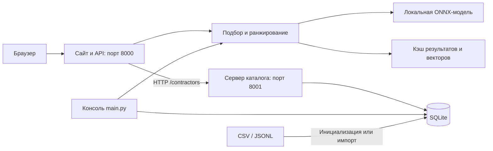

# HackAlem AI — умный подбор подрядчиков

Учебный проект команды **Larp** для организаторов мероприятий. Помогает выбрать ведущего, площадку или другого подрядчика из каталога: проверяет обязательные условия, сравнивает описания с пожеланиями и возвращает до трёх вариантов с объяснениями.

Проект сокращает ручной просмотр анкет. Если исходные условия не дают совпадений, система рассчитывает отдельное изменение бюджета или даты, которое действительно допускает кандидатов по данным каталога.

## Что реализовано

- Веб-сайт с главной страницей, формой подбора и просмотром каталога; консольный интерфейс и JSON-режим.
- Обязательные фильтры по городу, категории, дате, формату мероприятия и бюджету. Язык и длительность становятся обязательными ограничениями, если заполнены.
- Смысловое ранжирование описаний предобученной нейросетью по текстовым пожеланиям.
- До трёх карточек со стартовой ценой, объяснением, фрагментом исходного описания и предупреждениями о данных.
- Проверка отдельных русскоязычных пожеланий о конкурсах и играх: прямое подтверждение, противоречие или отсутствие подтверждения в описании.
- Объяснение пустого результата: нет категории в городе либо кандидаты не проходят условия; причины исключения доступны в API.
- Проверенные предложения при пустом результате: минимальный подходящий бюджет и ближайшая подходящая дата. Каждое меняет только одно условие и применяется после выбора пользователя.
- Общая SQLite-база для сайта и консоли, импорт CSV/JSONL, кэш результатов и эмбеддингов.
- HTTP API, проверка входных данных, ограничение запросов и настройка CORS для отдельного фронтенда.

## Как работает решение

1. Пользователь задаёт город, дату, формат мероприятия, категорию и бюджет. При необходимости добавляет длительность, язык и свободные пожелания.
2. Система нормализует ввод и проверяет структурированные поля каталога. Занятые на указанную дату или не подходящие по обязательным условиям профили исключаются.
3. Нейросеть переводит пожелания и фрагменты описаний оставшихся кандидатов в числовые векторы. Если пожелания пусты, используется контекст категории и формата мероприятия.
4. Кандидаты упорядочиваются по числу выявленных противоречий пожеланиям, затем по смысловой близости. При равенстве учитываются стартовая цена и ID.
5. Пользователь получает до трёх карточек. Объяснение составляется из проверенных полей и фрагмента описания, выбранного по близости к запросу.
6. Если совпадений нет, пользователь видит причины и доступные предложения изменения запроса. До нажатия «Применить это изменение» исходные условия остаются прежними.

Предложения проверяются по обязательным условиям, а пожелания остаются мягкими предпочтениями. Предложенный профиль не считается совпадением с исходным запросом.

### Роль ИИ

Используется готовая модель `sentence-transformers/paraphrase-multilingual-MiniLM-L12-v2` в квантованном ONNX-формате. Дообучение в проекте не выполняется.

Описания разбиваются на фрагменты с окном до 128 токенов; модель строит 384-мерные эмбеддинги. Итоговая оценка:

```text
0.7 × максимальная косинусная близость фрагмента
+ 0.3 × средняя косинусная близость фрагментов
```

Коэффициенты — инженерное правило. `semantic_score` обозначает смысловую близость, а не вероятность, качество услуг или гарантию выполнения пожеланий. Генеративная LLM для ответов не используется: объяснения опираются на каталог.

## Технологии

| Компонент | Реализация |
| --- | --- |
| Серверная логика | Python 3.11–3.13, 64-bit |
| HTTP-сервисы | Стандартная библиотека Python: `http.server`, `urllib`, потоки |
| Интерфейс | HTML, CSS, JavaScript, Fetch API; без отдельной сборки фронтенда |
| Хранение | SQLite через `sqlite3`; CSV/JSONL для импорта |
| Численные операции | NumPy 2.3.5 |
| Инференс на CPU | ONNX Runtime 1.23.2 |
| Токенизация | Hugging Face Tokenizers 0.22.1 |
| AI-модель | Multilingual MiniLM L12 v2, квантованные ONNX-веса |
| Тестирование | `unittest`, интеграционные проверки HTTP и реальной модели |
| Загрузка модели | Hugging Face, фиксированная ревизия и SHA-256 файлов |

Зависимости указаны в [requirements.txt](requirements.txt), версия и контрольные суммы модели — в [config/model.lock.json](config/model.lock.json). API-ключи не нужны. После установки библиотек и подготовки модели подбор работает локально без внешнего API инференса.

## Архитектура



`run_web.py` запускает оба сервиса, проверяет свободные порты и готовность процессов, открывает браузер. Перед готовностью веб-сервера прогреваются два экземпляра модели. При остановке через `Ctrl+C` завершаются дочерние процессы.

| Путь | Назначение |
| --- | --- |
| `main.py`, `run_web.py` | Точки входа консоли и сайта |
| `hackalem/catalog.py` | Схема данных, нормализация и обязательные фильтры |
| `hackalem/catalog_store.py` | SQLite и импорт каталога |
| `hackalem/catalog_server.py`, `catalog_client.py` | HTTP-доступ к каталогу, ETag и ответы 304 |
| `hackalem/recommender.py` | Ранжирование, карточки и предложения изменения условий |
| `hackalem/ai_model.py`, `preferences.py` | Модель, эмбеддинги и правила проверки пожеланий |
| `hackalem/web_server.py`, `cli.py`, `launcher.py` | API, консоль и управление запуском |
| `web/` | Страницы, стили и общие части интерфейса |
| `data/catalog.csv` | Каталог, включённый в репозиторий |
| `config/`, `models/`, `cache/` | Конфигурация модели, загружаемые файлы и кэш |
| `examples/`, `tests/`, `scripts/` | Примеры запросов, тесты и служебные команды |
| `docs/`, `reports/` | Дополнительная документация и сохранённые отчёты |

## Установка и запуск

Нужны Git, **Python 3.11–3.13 64-bit**, доступ в интернет для первой установки и свободные порты **8000 и 8001**. Модель выполняется на CPU, GPU не требуется. Целевая конфигурация — Windows/Linux x86-64; работа на ARM отдельно не подтверждена.

Веса и токенизатор скачиваются при подготовке, суммарно около 127 МБ; библиотеки требуют дополнительного места и трафика. Модель, база, кэш и локальные окружения не входят в Git.

### Windows / PowerShell

Клонируйте репозиторий и перейдите в его корень:

```powershell
git clone https://github.com/BAITC-Hacks/hack-ee0863ec-larp.git
cd hack-ee0863ec-larp
```

Создайте окружение, установите библиотеки и подготовьте модель:

```powershell
py -3.13 -m venv .venv
.\.venv\Scripts\python.exe -m pip install -r requirements.txt
.\.venv\Scripts\python.exe main.py --prepare
```

Если `py` недоступен, используйте `python -m venv .venv`, предварительно проверив версию командой `python --version`. Активировать окружение не обязательно.

Запустите сайт:

```powershell
.\.venv\Scripts\python.exe run_web.py
```

Откроется [главная страница](http://127.0.0.1:8000). Форма доступна по адресу [http://127.0.0.1:8000/search](http://127.0.0.1:8000/search). Остановка — `Ctrl+C` в терминале запуска. Флаг `--no-browser` отключает автоматическое открытие браузера.

Для консольного интерфейса:

```powershell
.\.venv\Scripts\python.exe main.py --offline
```

Также есть `scripts/run_windows.bat`: он создаёт окружение, устанавливает зависимости, подготавливает модель и запускает **консольный интерфейс**.

### Linux

Из корня клонированного репозитория, с установленным Python поддерживаемой версии:

```bash
python3 -m venv .venv
.venv/bin/python -m pip install -r requirements.txt
.venv/bin/python main.py --prepare
.venv/bin/python run_web.py
```

### Если запуск не удался

- При отсутствии модели выполните `main.py --prepare` с доступом к Hugging Face. Веб-сервер сам веса не скачивает.
- Если порт занят, остановите ранее запущенный экземпляр проекта.
- Запускайте `run_web.py`, чтобы одновременно работали сайт и сервер каталога.
- Изменение CSV не обновляет существующую SQLite-базу автоматически; используйте импорт из раздела «Данные и интеграции».

## Как проверить решение

### Основной сценарий для жюри

1. Запустите сайт и откройте `/search`.
2. Заполните параметры из таблицы или воспользуйтесь кнопкой примера.
3. Нажмите «Подобрать подрядчиков» и изучите карточки, предупреждения и раскрываемое объяснение выбора.

| Поле | Значение |
| --- | --- |
| Город | Алматы |
| Категория | Ведущий |
| Дата | 14.11.2026 |
| Формат | корпоратив |
| Бюджет | 1 200 000 ₸ |
| Длительность | 6 часов |
| Язык | русский |
| Пожелания | Интеллигентный юмор, импровизация, общение с гостями без банальных конкурсов |

В текущем `data/catalog.csv` обязательные условия проходят **5 профилей**, показываются **3 карточки**. Эти числа относятся к поставляемому каталогу; после импорта других данных результат может измениться.

Тот же запрос можно выполнить без браузера:

```powershell
.\.venv\Scripts\python.exe main.py --catalog data/catalog.csv --query examples/dense.json --offline --json
```

### Пустой результат и полезное изменение условий

| Пример | Исходный результат | Отдельное предложение |
| --- | --- | --- |
| `examples/budget.json` | Нет совпадений при бюджете 100 000 ₸ | Увеличить только бюджет до **800 000 ₸** |
| `examples/venue_busy.json` | Нет совпадений на 14.11.2026 | Изменить только дату на **15.11.2026**: допускается `HK-90012` |
| `examples/venue_free.json` | Один подходящий профиль `HK-90012` | Уже выполнен запрос на 15.11.2026 |

```powershell
.\.venv\Scripts\python.exe main.py --catalog data/catalog.csv --query examples/budget.json --offline --json
.\.venv\Scripts\python.exe main.py --catalog data/catalog.csv --query examples/venue_busy.json --offline --json
.\.venv\Scripts\python.exe main.py --catalog data/catalog.csv --query examples/venue_free.json --offline --json
```

У первых двух ответов исходный список `cards` пуст, а варианты находятся в отдельном поле `suggestions`. В веб-форме изменение применяется кнопкой, в интерактивной консоли — выбором номера. Для JSON-режима нужно отправить новый запрос с выбранным значением. У площадки должны сохраняться предупреждения о синтетическом профиле и неподтверждённой цене.

### Автоматические проверки

Обычный набор тестов; проверки реальной модели по умолчанию пропускаются:

```powershell
.\.venv\Scripts\python.exe -m unittest discover -s tests -v
```

С реальной моделью после `--prepare`:

```powershell
$env:RUN_AI_TESTS="1"
.\.venv\Scripts\python.exe -m unittest discover -s tests -v
Remove-Item Env:RUN_AI_TESTS
```

Проверка повторяемости в двух процессах без постоянного кэша:

```powershell
.\.venv\Scripts\python.exe scripts/check_determinism.py
```

**Текущее ограничение тестов:** часть проверок в `tests/test_core.py` всё ещё ожидает исходный каталог из 66 записей и прежние результаты. В текущем CSV 166 записей; например, `examples/no_category.json` теперь находит кандидатов. Проверки, рассчитывающие на пустой результат этого примера, требуют актуализации. Сохранённые отчёты в `reports/` не подтверждают успешное прохождение всего набора на текущей версии.

## Данные и интеграции

### Каталог

Источник подбора — [data/catalog.csv](data/catalog.csv). В текущей версии:

| Характеристика | Значение |
| --- | --- |
| Профилей | 166 |
| Категорий | 17 |
| Значения поля города | Алматы, Астана, Зарубежье |
| Помечены `synthetic` | 113 |
| Помечены `price_imputed` | 118 |
| Помечены `city_imputed` | 108 |
| Известный календарь | 23.09.2026–31.12.2026 |

Флаги могут пересекаться. Синтетические записи служат для демонстрации и не подтверждают существование реального подрядчика. `price_imputed` и `city_imputed` отмечают значения, проставленные при подготовке данных.

Основные поля: ID, имя, категории, город, стартовая цена, форматы мероприятий, языки, предельная длительность, занятые даты и описание. `max_hours = null` означает неприменимость ограничения длительности присутствия. Цена `price_from_kzt` задаётся в тенге за мероприятие и не является почасовой ставкой.

При первом запуске CSV заполняет `data/catalog.sqlite3`. Сайт и консоль по умолчанию читают эту базу. Обновление:

```powershell
.\.venv\Scripts\python.exe -m scripts.import_catalog data/catalog.csv
```

Команда **полностью заменяет каталог** после проверки входных записей. Поддерживаются CSV и JSONL с той же схемой. Сайт получает обновление при следующем запросе, консоль — при следующем запуске. Параметр консоли `--catalog` позволяет читать отдельный файл напрямую.

[Описание источников](docs/SOURCES.md) документирует исходный набор хакатона и происхождение модели. Указанные там сведения о побайтовой копии исходного CSV относятся к прежнему набору, а не к расширенному каталогу текущей версии.

### API и внешние сервисы

| Сервис | Метод и путь | Назначение |
| --- | --- | --- |
| Сайт, порт 8000 | `GET /api/options` | Значения для полей формы |
| Сайт, порт 8000 | `GET /api/catalog` | Просмотр профилей |
| Сайт, порт 8000 | `POST /api/recommend` | Подбор по JSON-запросу |
| Сайт, порт 8000 | `GET /health` | Готовность сервиса |
| Каталог, порт 8001 | `GET /contractors` | Каталог с поддержкой ETag |
| Каталог, порт 8001 | `GET /health` | Состояние сервера каталога |

`POST /api/recommend` принимает `Content-Type: application/json`. Обязательные поля: `city`, `event_date`, `event_format`, `category`, `budget_kzt`. Необязательные: `hours`, `language`, `preferences`. Готовое тело запроса — [examples/dense.json](examples/dense.json).

Ответ содержит статус (`found`, `no_matches`, `no_category_in_city`), нормализованный запрос, карточки, причины исключения, предложения и сведения об использовании модели.

Внешний источник модели — Hugging Face; загрузчик использует фиксированную ревизию и проверяет SHA-256. Во время подбора запрос и каталог обрабатываются локально. Интеграций с внешними календарями, сервисами бронирования или платёжными API нет.

Для отдельного фронтенда можно разрешить конкретный origin:

```powershell
.\.venv\Scripts\python.exe run_web.py --allow-origin http://localhost:5173
```

Подробнее: [сайт и API](docs/WEB_README.md).

## Ограничения текущей версии

- Это локальный учебный прототип. Бронирование, оплата, переписка, личные кабинеты и редактирование каталога через сайт не реализованы.
- Занятость известна только по учебному календарю в указанном диапазоне. Цена «от» и наличие даты требуют отдельного подтверждения у подрядчика.
- Смысловое сходство не гарантирует выполнение пожеланий. Проверка отрицаний ограничена отдельными формулировками о конкурсах и играх; например, «без банальных конкурсов» не означает «без любых конкурсов».
- Семантического порога отсечения нет: система ранжирует прошедших обязательные фильтры, даже если описание слабо подтверждает пожелания.
- Предложения меняют только бюджет или только дату. Для даты выбирается ближайший день внутри известного окна, при равном расстоянии — более поздний. Комбинации нескольких изменений не рассчитываются.
- При пустом результате семантическое ранжирование не выполняется. Однако веб-сервер загружает модель при старте; без подготовленных весов он не запускается.
- По умолчанию доступны два одновременных подбора и 30 запросов подбора в минуту с одного IP; при превышении возвращается HTTP 429. Две копии модели увеличивают потребление памяти.
- Повторяемость рассчитана на одинаковые данные, код, модель и окружение. После смены платформы или библиотек численная идентичность не гарантируется.
- Нет размеченного людьми эталонного набора и подтверждённой метрики качества рекомендаций. Есть [методика оценки nDCG@3](docs/EVALUATION.md) и скрипт `scripts/evaluate_ranking.py`; результаты оценки качества не заявляются.
- Часть тестовых ожиданий и исторических документов требует обновления после расширения каталога.

## Развёрнутая версия

Публичная deployed-версия в репозитории не указана. Подтверждённый способ демонстрации — локальный запуск: **[http://127.0.0.1:8000](http://127.0.0.1:8000)**. Этот адрес доступен на компьютере, где запущен проект; для публикации потребуется отдельное развёртывание.
