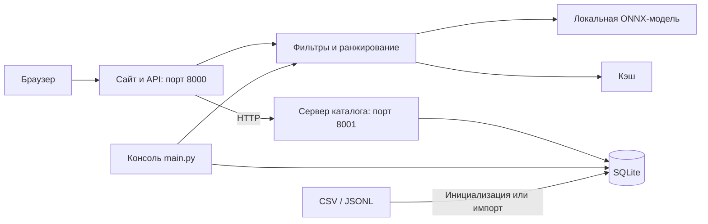

# FSP (Fast Search Project) — умный подбор подрядчиков

Проект команды **Larp** для организаторов мероприятий. Помогает составить короткий список ведущих, площадок и других подрядчиков: проверяет дату, бюджет и обязательные требования, сравнивает описания с пожеланиями и показывает до трёх вариантов с объяснениями.

Если совпадений нет, система рассчитывает изменения условий, которые действительно допускают кандидатов по каталогу. Пользователь сам решает, применять ли предложение.

## Что реализовано

- Веб-сайт с главной страницей, формой подбора и просмотром каталога.
- Консольный интерфейс, запросы из JSON и машиночитаемый JSON-ответ.
- Строгая фильтрация по городу, категории, дате, формату мероприятия и бюджету; по языку и длительности, если они указаны.
- Смысловое ранжирование описаний готовой нейросетью по свободным пожеланиям.
- До трёх карточек со стартовой ценой, объяснением и фрагментом исходного описания.
- Предупреждения о синтетических профилях, проставленных при подготовке данных ценах и городах. Синтетические профили можно исключить из поиска и отображения каталога.
- Проверка отдельных русскоязычных пожеланий о конкурсах и играх: подтверждение в описании, противоречие или отсутствие подтверждения.
- Отдельные предложения изменения бюджета или даты; дополнительный бюджет для большего выбора; совместное изменение даты и бюджета, если одиночных предложений нет.
- SQLite-каталог, импорт CSV/JSONL с резервным копированием, восстановление из резервной копии.
- Кэширование, HTTP API, валидация запросов, ограничение нагрузки и настраиваемый CORS.

## Как работает решение

1. Пользователь вводит город, дату, формат мероприятия, категорию и бюджет. Необязательно указывает часы, язык и пожелания.
2. Система нормализует ввод и исключает записи, не соответствующие обязательным полям. Текст описания не переопределяет занятость, цену или другие структурированные ограничения.
3. Нейросеть переводит пожелания и фрагменты описаний прошедших кандидатов в векторы. Если пожеланий нет, используется контекст категории и формата.
4. Кандидаты сортируются по числу выявленных противоречий пожеланиям, затем по смысловой близости. При равенстве учитываются цена и ID.
5. Пользователь видит до трёх карточек, причины выбора и предупреждения. Объяснение составляется из полей каталога и исходного фрагмента описания.
6. При пустом результате выводятся причины и доступные предложения. Исходные карточки остаются пустыми; изменённый запрос выполняется только после выбора пользователя.

Пожелания — мягкие предпочтения: прохождение обязательных фильтров не означает, что описание подтверждает каждое пожелание.

### Где используется ИИ

Модель `sentence-transformers/paraphrase-multilingual-MiniLM-L12-v2` выполняется локально в квантованном ONNX-формате на CPU. Дообучение в проекте не выполняется.

Длинные описания разбиваются на фрагменты до 128 токенов; модель строит 384-мерные эмбеддинги. Оценка кандидата:

```text
0.7 × максимальная косинусная близость фрагмента
+ 0.3 × средняя косинусная близость фрагментов
```

Коэффициенты — инженерное правило. `semantic_score` показывает близость смысла, а не вероятность, качество услуг или гарантию выполнения требований. Генеративная LLM не используется; факты и цитаты берутся из каталога.

## Технологии

| Часть решения | Технологии |
| --- | --- |
| Сервер и консоль | Python 3.11–3.13, 64-bit |
| HTTP-сервисы | Стандартная библиотека Python: `http.server`, `urllib`, потоки |
| Интерфейс | HTML, CSS, JavaScript, Fetch API; отдельная сборка не нужна |
| Хранение | SQLite через `sqlite3`, CSV/JSONL для импорта |
| Вычисления | NumPy 2.3.5 |
| Локальный инференс | ONNX Runtime 1.23.2, CPU |
| Токенизация | Hugging Face Tokenizers 0.22.1 |
| AI-модель | Multilingual MiniLM L12 v2 |
| Проверки | `unittest`, тесты HTTP-сервисов и реальной модели |

Зависимости: [requirements.txt](requirements.txt). Ревизия модели и SHA-256: [config/model.lock.json](config/model.lock.json).

Hugging Face используется для первоначального скачивания модели. После подготовки подбор работает локально, без API-ключей и внешнего API инференса.

## Архитектура проекта



`run_web.py` запускает оба сервиса, проверяет свободные порты и готовность процессов, затем открывает браузер. Веб-сервер предварительно загружает два экземпляра модели. При остановке через `Ctrl+C` завершаются дочерние процессы.

| Путь | Назначение |
| --- | --- |
| `main.py`, `run_web.py` | Запуск консоли и сайта |
| `hackalem/catalog.py` | Схема данных, нормализация, обязательные фильтры |
| `hackalem/catalog_store.py` | SQLite, импорт и резервные копии |
| `hackalem/catalog_server.py`, `hackalem/catalog_client.py` | HTTP-доступ к каталогу, ETag и ответы 304 |
| `hackalem/recommender.py` | Ранжирование, карточки, предложения изменения условий |
| `hackalem/ai_model.py`, `hackalem/preferences.py` | Модель, эмбеддинги и проверка пожеланий |
| `hackalem/web_server.py`, `hackalem/cli.py`, `hackalem/launcher.py` | API, консоль и управление процессами |
| `web/` | Страницы, стили и общие части интерфейса |
| `data/catalog.csv` | Поставляемый каталог |
| `config/`, `models/`, `cache/` | Конфигурация, загружаемая модель и кэш |
| `examples/`, `tests/`, `scripts/` | Примеры, тесты и служебные команды |
| `docs/`, `reports/` | Дополнительная документация и исторические отчёты |

## Установка и запуск

Нужны **Python 3.11–3.13 64-bit**, Git, интернет при первой установке и свободные порты **8000 и 8001**. GPU не требуется. Целевая конфигурация — Windows/Linux x86-64; работа на ARM отдельно не подтверждена.

Веса и токенизатор занимают около 127 МБ суммарно, библиотеки требуют дополнительного места и трафика. Модель, локальные окружения, база и кэш не включены в Git.

### Windows / PowerShell

Клонируйте проект:

```powershell
git clone https://github.com/BAITC-Hacks/hack-ee0863ec-larp.git
cd hack-ee0863ec-larp
```

Из корня проекта создайте окружение и подготовьте модель:

```powershell
py -3.13 -m venv .venv
.\.venv\Scripts\python.exe -m pip install -r requirements.txt
.\.venv\Scripts\python.exe main.py --prepare
```

Если `py` недоступен, используйте `python -m venv .venv`, предварительно проверив поддерживаемую версию командой `python --version`. Активировать окружение не обязательно.

Запустите сайт:

```powershell
.\.venv\Scripts\python.exe run_web.py
```

Главная страница: [http://127.0.0.1:8000](http://127.0.0.1:8000). Форма подбора: [http://127.0.0.1:8000/search](http://127.0.0.1:8000/search). Остановка — `Ctrl+C` в терминале запуска. Флаг `--no-browser` отключает автоматическое открытие браузера.

Для консоли:

```powershell
.\.venv\Scripts\python.exe main.py --offline
```

Альтернатива ручной установке для **консольного** режима — [scripts/run_windows.bat](scripts/run_windows.bat): создаёт окружение, устанавливает зависимости, подготавливает модель и запускает консоль.

### Linux

После клонирования, из корня проекта с установленным Python поддерживаемой версии:

```bash
python3 -m venv .venv
.venv/bin/python -m pip install -r requirements.txt
.venv/bin/python main.py --prepare
.venv/bin/python run_web.py
```

### Частые проблемы

- **Нет модели:** выполните `main.py --prepare` с доступом к Hugging Face. Веб-сервер сам веса не скачивает.
- **Порт занят:** остановите ранее запущенный экземпляр проекта.
- **Каталог недоступен:** запускайте `run_web.py`, который поднимает оба сервиса.
- **Изменённый CSV не виден на сайте:** импортируйте его в SQLite по инструкции ниже. Перезапуска сайта недостаточно для обновления уже заполненной базы.

## Как проверить решение

### Сценарий для жюри

1. Установите зависимости и подготовьте модель.
2. Для уже существующей базы при необходимости импортируйте поставляемый `data/catalog.csv` по инструкции ниже. Импорт заменяет каталог с сохранением резервной копии.
3. Запустите сайт, откройте `/search`, оставьте включёнными учебные профили.
4. Заполните форму параметрами из таблицы и нажмите «Подобрать подрядчиков».
5. Изучите карточки и раскрываемые объяснения, проверьте предупреждения.

| Поле | Значение |
| --- | --- |
| Город | Алматы |
| Категория | Ведущий |
| Дата | 14.11.2026 |
| Формат | корпоратив |
| Бюджет | 1 200 000 ₸ |
| Длительность | 6 часов |
| Язык | русский |
| Пожелания | Интеллигентный юмор, импровизация, общение с гостями без банальных конкурсов |

Для текущего поставляемого CSV обязательные условия проходят **5 профилей**, показываются **3 карточки**. Числа зависят от каталога и включения синтетических записей.

Тот же сценарий напрямую по файлу, независимо от состояния SQLite:

```powershell
.\.venv\Scripts\python.exe main.py --catalog data/catalog.csv --query examples/dense.json --offline --json
```

### Проверка пустого результата

| Пример | Ожидаемый результат по текущему CSV |
| --- | --- |
| `examples/budget.json` | Исходный бюджет 100 000 ₸ не даёт совпадений. Минимальное предложение — 800 000 ₸; дополнительное для большего выбора — 1 000 000 ₸ |
| `examples/venue_busy.json` | На 14.11.2026 совпадений нет; изменение только даты на 15.11.2026 допускает `HK-90012` |
| `examples/venue_free.json` | На 15.11.2026 проходит один профиль `HK-90012` |

```powershell
.\.venv\Scripts\python.exe main.py --catalog data/catalog.csv --query examples/budget.json --offline --json
.\.venv\Scripts\python.exe main.py --catalog data/catalog.csv --query examples/venue_busy.json --offline --json
.\.venv\Scripts\python.exe main.py --catalog data/catalog.csv --query examples/venue_free.json --offline --json
```

У первых двух запросов `cards` остаётся пустым, а варианты находятся в `suggestions`. В веб-интерфейсе они применяются кнопкой, в интерактивной консоли — выбором номера. Для JSON-режима нужен отдельный запрос с выбранными изменениями. Предупреждения о синтетическом профиле площадки и неподтверждённой цене сохраняются.

### Тесты и повторяемость

При проверке 23.09.2026 на Windows с Python 3.13.7 прошли **94 теста**, включая проверки реальной модели (`RUN_AI_TESTS=1`). Скрипт проверки повторяемости вернул `PASS` на локальной SQLite-базе. Это проверка корректности и повторяемости, а не оценка качества рекомендаций людьми.

Базовый набор; интеграционные проверки реальной модели по умолчанию пропускаются:

```powershell
.\.venv\Scripts\python.exe -m unittest discover -s tests -v
```

После подготовки модели включите её интеграционные проверки:

```powershell
$env:RUN_AI_TESTS="1"
.\.venv\Scripts\python.exe -m unittest discover -s tests -v
Remove-Item Env:RUN_AI_TESTS
```

На Linux эквивалент: `RUN_AI_TESTS=1 .venv/bin/python -m unittest discover -s tests -v`.

Проверка двух независимых запусков с настоящей моделью без постоянного кэша:

```powershell
.\.venv\Scripts\python.exe scripts/check_determinism.py
```

Скрипт использует общую SQLite-базу. Результат `PASS` означает совпадение состава, порядка, оценок и объяснений между двумя процессами в текущем окружении.

Часть регрессионных тестов использует фиксированный исходный каталог из 66 записей в `tests/fixtures/original_catalog.csv`. Расширенный каталог из 166 профилей проверяется отдельно в `tests/test_merged_catalog.py`. Исторические логи в `reports/` не следует считать результатом проверки текущей версии: для этого выполняйте команды выше.

## Данные и интеграции

### Каталог и хранение

Источник подбора — [data/catalog.csv](data/catalog.csv). Текущий файл содержит **166 профилей**, **17 категорий**, значения города **Алматы, Астана, Зарубежье**. В него входят 100 добавленных профилей с ID `SYN-2026-*`.

| Флаг | Количество записей | Значение |
| --- | --- | --- |
| `synthetic` | 113 | Синтетический учебный профиль |
| `price_imputed` | 118 | Цена проставлена при подготовке данных |
| `city_imputed` | 108 | Город проставлен при подготовке данных |

Флаги пересекаются. Синтетические записи не подтверждают существование реального подрядчика. Текстовые описания — сведения из профилей, а не независимая проверка услуг.

Календарь известен только на **23.09.2026–31.12.2026**. Цена `price_from_kzt` — стартовая цена за мероприятие в тенге, не почасовая ставка. `max_hours = null` означает неприменимость ограничения длительности присутствия.

При первом запуске CSV заполняет `data/catalog.sqlite3`. Сайт и консоль по умолчанию используют эту базу. Для обновления:

```powershell
.\.venv\Scripts\python.exe -m scripts.import_catalog data/catalog.csv
```

Импорт поддерживает CSV/JSONL с той же схемой, проверяет записи и **полностью заменяет каталог**. Перед заменой непустой базы сохраняется резервная копия в `data/backups/`. Сайт увидит обновление при следующем запросе, консоль — при следующем запуске.

Для восстановления укажите существующий файл резервной копии вместо имени в примере:

```powershell
.\.venv\Scripts\python.exe -m scripts.restore_catalog data/backups/catalog-TIMESTAMP.sqlite3
```

Восстановление также сохраняет предыдущую непустую базу. Резервные копии исключены из Git; их хранение и очистка выполняются вручную.

### API

| Сервис | Метод и путь | Назначение |
| --- | --- | --- |
| Сайт, порт 8000 | `GET /api/options` | Значения полей формы |
| Сайт, порт 8000 | `GET /api/catalog` | Каталог профилей |
| Сайт, порт 8000 | `POST /api/recommend` | Подбор |
| Сайт, порт 8000 | `GET /health` | Готовность сервиса |
| Каталог, порт 8001 | `GET /contractors` | Каталог с ETag |
| Каталог, порт 8001 | `GET /health` | Состояние сервера каталога |

`POST /api/recommend` принимает JSON с заголовком `Content-Type: application/json`. Обязательные поля: `city`, `event_date`, `event_format`, `category`, `budget_kzt`. Необязательные: `hours`, `language`, `preferences`, `include_synthetic` (по умолчанию `true`). Образец — [examples/dense.json](examples/dense.json).

Ответ содержит статус `found`, `no_matches` или `no_category_in_city`, исходный нормализованный запрос, карточки, причины исключения, предложения и сведения о модели. Для одиночного предложения изменение задано через `field` и `suggested_value`, для совместного — через объект `changes`.

Можно разрешить конкретный адрес отдельного фронтенда:

```powershell
.\.venv\Scripts\python.exe run_web.py --allow-origin http://localhost:5173
```

Подробности: [сайт и API](docs/WEB_README.md). Источники модели описаны в [docs/SOURCES.md](docs/SOURCES.md); сведения там об исходном CSV относятся к историческому набору, а не к текущему расширенному файлу.

## Ограничения

- Локальный учебный прототип: нет бронирования, оплаты, переписки, личных кабинетов и редактирования каталога через сайт.
- Нет интеграции с внешними календарями и подтверждёнными контактами. Занятость, окончательную стоимость и услуги нужно согласовывать отдельно.
- Проверка отрицаний ограничена отдельными формулировками о конкурсах и играх. Смысловая близость не доказывает выполнение пожелания; семантический порог отсечения не применяется.
- Предложения меняют бюджет, дату или оба поля; остальные обязательные требования сохраняются. Поиск даты ограничен известным календарём, при равном расстоянии выбирается более поздний день.
- При пустом результате ранжирование моделью не выполняется, но веб-сервер всё равно требует подготовленных весов для старта.
- По умолчанию обрабатываются два подбора одновременно, лимит — 30 запросов подбора в минуту с одного IP. При перегрузке API возвращает HTTP 429. Две копии модели требуют дополнительной памяти.
- Повторяемость рассчитана на неизменные данные, код, модель и окружение. После смены CPU или библиотек численная идентичность не гарантируется.
- Подтверждённой метрики качества по человеческой разметке пока нет. Есть [методика nDCG@3](docs/EVALUATION.md) и `scripts/evaluate_ranking.py`, но технические тесты не доказывают полезность рекомендаций для пользователей.

## Развёрнутая версия

Публичная deployed-ссылка в репозитории не указана. Для демонстрации используйте локальный запуск: **[http://127.0.0.1:8000](http://127.0.0.1:8000)**. Адрес доступен на компьютере, где работает проект. Публикация в интернете требует отдельного развёртывания.
